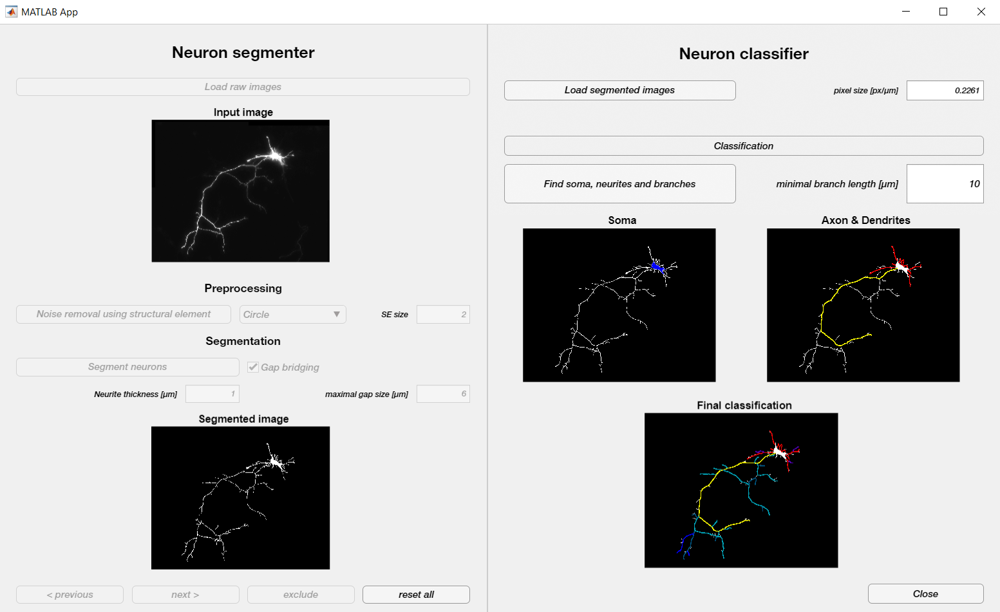

# NeuronAnalysis

# Batch analyzing the morphology of sparsely cultured primary neurons

This MATLAB-based tool was developed to analyze fluorescence micrographs of cultured neurons for the automated quantitative analysis of axon length and branching. Files are automatically imported, and visual and numeric results are saved as standard file formats for further downstream processing and analysis.

**Using the tool**

To use the tool, open MATLAB (version 2019 or higher), set this folder as your working directory and start the tool by typing Neuron_Classifier_2() in the console. Continue by loading raw images (left side of the GUI, "Neuron Segmenter"), or by loading pre-segmented images as binary tif-files (right side of the GUI, "Neuron Classifier"). We encourage to optimize preprocessing and segmentation parameters on a subset of your dataset to maximize segmentation quality, before proceeding with the batch analysis of the full dataset. For Classification, specify a minimal length (in µm) that is considered a relevant protrusion. The software will save a binary segmented image in a 'Segmented' folder, an annotated image in 'Results/Figures' and a .csv file including summarized quantitative readouts per neuron.

**Suitable raw data**

When applying the tool to your own data, you have to preprocess the images to single-channel tif and potentially crop, such that only one neuron is visible and neurons do not intersect with each other. For maintaining neuron health, rather than to image individually growing neurons, we advise to sparsely transfect neurons in dense cultures with a cytosolic or membrane bound fluorophore and to analyze only the signal of that fluorophore. Example images for testing the software (and for comparison to your experimental data) can be found in the 'Test Images' folder. If the analyzed images include metadata about scale, the software will use it. Otherwise, please specify the pixel size in the respective field. In that case, also make sure to only analyze images in one batch if they share the same pixel size!

**More information**

All analysis codes can be reviewed in separate functions in the 'functions/' folder. The exact sequence of the algorithm and batch-processing can be reviewed by opening "Neuron_Classifier_2.mlapp" in MATLAB App Designer.

Link to the preprint: [Automated Analysis of Neuronal Morphology through an Unsupervised Classification Model of Neurites](https://www.biorxiv.org/content/10.1101/2022.03.01.482454v1)

